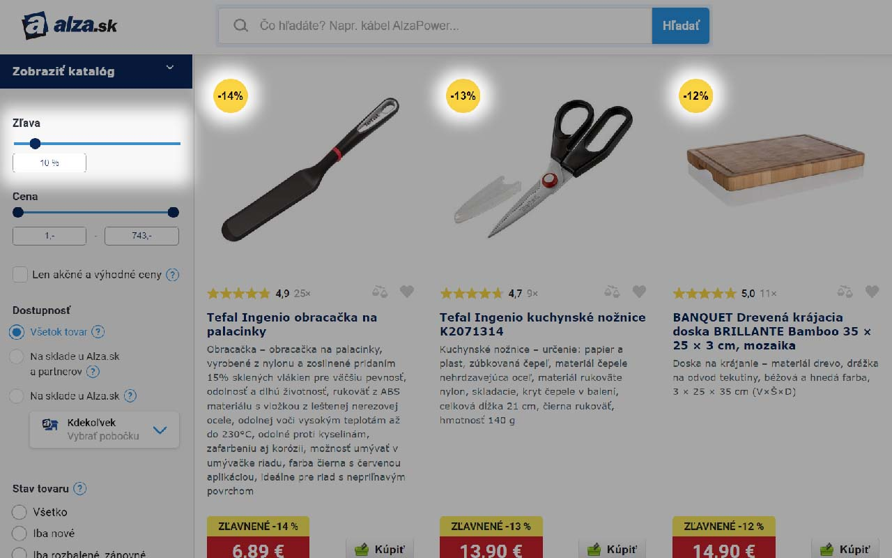

# Alza Discount Filter Chrome Extension

This is a Chrome extension that allows users to filter items based on discount value on the [Alza.sk](https://www.alza.sk/) and [Alza.cz](https://www.alza.cz/) websites. It injects a discount value filter within the site's HTML, and only displays items that are equal to or higher than the selected value.

## Features

- Easy-to-use: The discount filter is seamlessly integrated into the Alza website's interface.

## Installation

You can install the Alza Discount Filter extension from the [Chrome Web Store](https://chrome.google.com/webstore/detail/alza-discount-filter/lejmjigbnilnagneolhegodbkpbaofki).

## Usage

Once installed, navigate to the Alza website and use the discount filter to customize your shopping experience.

## Known Issues and Limitations

Please note that the extension has not yet been thoroughly tested with dynamically loaded content on the Alza website (infinite scroll), it might behave unexpectedly in such cases. As of now the big limitation of the extension is only filtering items that have been already loaded on the page, it does not make any calls to alza api.

## Contributing

Contributions are welcome! Please feel free to submit a pull request on GitHub.

## License

This project is licensed under the MIT License - see the [LICENSE](LICENSE) file for details. (Please add a LICENSE file in your repository if you agree with the MIT License)

## Contact

If you have any questions, suggestions, or need support, please feel free to contact me:

- Email: vladimirpolak.dev@gmail.com
- Discord: Dio#7865
